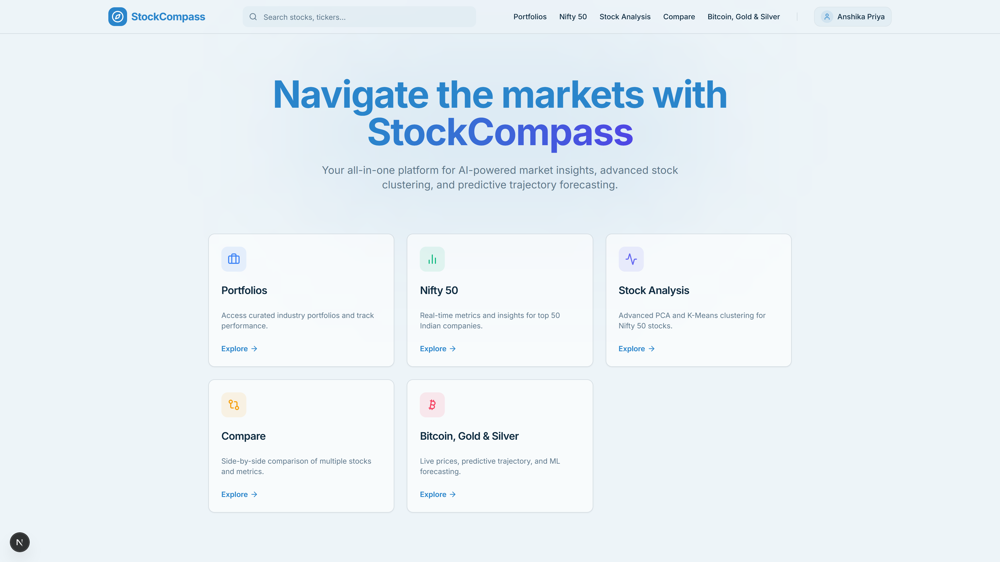
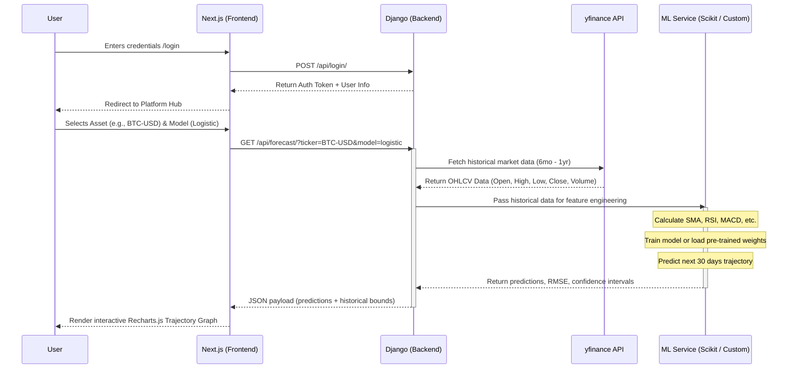
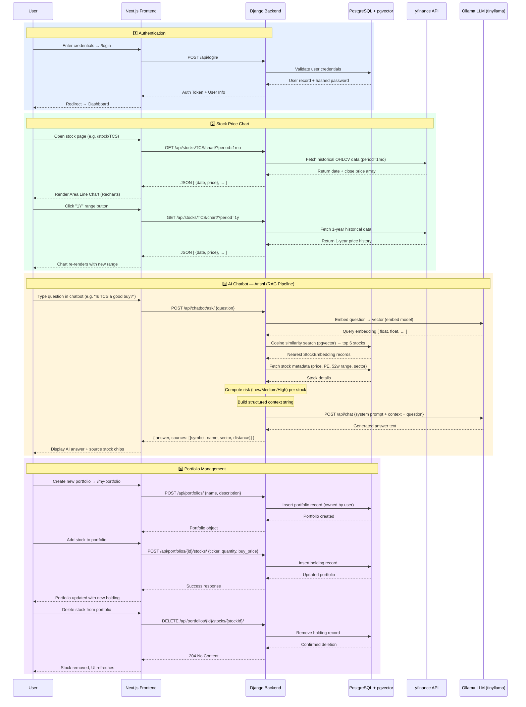

# 📈 Update Stock Prices

To update stock prices for the past month, run the following command in the backend directory:

```bash
python manage.py init_stocks --update-prices --period 1mo
```

# StockCompass
[](https://github.com/anshika1501/StockCompass-AI)

StockCompass is a comprehensive, AI-powered stock analysis platform featuring curated industry portfolios, stock clustering, and predictive trajectory forecasting using machine learning models. Your in-app assistant is **Anshi (StockCompass AI)**.



The project is divided into a **Django** backend that handles data fetching, ML modeling, and API endpoints, alongside a **Next.js** frontend showcasing a modern, glassmorphic UI.

## Prerequisites

Before you begin, ensure you have the following installed on your machine:
- [Node.js](https://nodejs.org/) (v16.x or higher)
- npm or yarn
- [Python](https://www.python.org/) 3.10+
- Git
- [Docker](https://www.docker.com/) + Docker Compose (recommended)
- [PostgreSQL](https://www.postgresql.org/) 14+ (optional if not using Docker)
- [Ollama](https://ollama.com/download) (optional if not using Docker)

---

# 🐳 Running StockCompass with Docker (Recommended)

This setup runs:

- PostgreSQL 16 + pgvector
- pgAdmin 4
- Ollama (LLM + Embeddings)
- Auto model installation
- Persistent volumes
- Auto restart

---

## ✅ 1️⃣ Install Docker

Install:

- Docker
- Docker Compose

Verify:

```bash
docker --version
docker compose version
```

---

## ✅ 2️⃣ Create docker-compose.yml (Project Root)

Create a file:

```bash
docker-compose.yml
```

Paste:

```yaml
services:
   pgvector-db:
      image: pgvector/pgvector:pg16
      container_name: pgvector-db
      restart: unless-stopped
      environment:
         POSTGRES_USER: postgres
         POSTGRES_PASSWORD: postgres
         POSTGRES_DB: stocks
      ports:
         - "5432:5432"
      volumes:
         - pgdata:/var/lib/postgresql/data
         - ./init.sql:/docker-entrypoint-initdb.d/init.sql
      networks:
         - stock-network

   pgadmin:
      image: dpage/pgadmin4
      container_name: pgadmin
      restart: unless-stopped
      environment:
         PGADMIN_DEFAULT_EMAIL: admin@admin.com
         PGADMIN_DEFAULT_PASSWORD: admin
      ports:
         - "5050:80"
      depends_on:
         - pgvector-db
      networks:
         - stock-network

   ollama:
      image: ollama/ollama
      container_name: ollama
      restart: unless-stopped
      ports:
         - "11434:11434"
      volumes:
         - ollama:/root/.ollama
      networks:
         - stock-network
      entrypoint: >
         /bin/sh -c "
         ollama serve &
         sleep 8 &&
         ollama pull tinyllama &&
         ollama pull qwen3-embedding:0.6b &&
         wait
         "

volumes:
   pgdata:
   ollama:

networks:
   stock-network:
```

---

## ✅ 3️⃣ Create init.sql (Same Folder)

Create:

```bash
init.sql
```

Paste:

```sql
CREATE USER stocks_user WITH PASSWORD 'change-me';
GRANT ALL PRIVILEGES ON DATABASE stocks TO stocks_user;
ALTER DATABASE stocks OWNER TO stocks_user;

\c stocks

CREATE EXTENSION IF NOT EXISTS vector;

ALTER SCHEMA public OWNER TO stocks_user;
GRANT ALL ON SCHEMA public TO stocks_user;
GRANT ALL PRIVILEGES ON ALL TABLES IN SCHEMA public TO stocks_user;
GRANT ALL PRIVILEGES ON ALL SEQUENCES IN SCHEMA public TO stocks_user;
ALTER DEFAULT PRIVILEGES IN SCHEMA public GRANT ALL ON TABLES TO stocks_user;
```

---

## ✅ 4️⃣ Start All Services

```bash
docker compose up -d
```

First run will take a few minutes because Ollama downloads:

- tinyllama
- qwen3-embedding:0.6b

---

## ✅ 5️⃣ Access Services

| Service    | URL                                              |
| ---------- | ------------------------------------------------ |
| pgAdmin    | [http://localhost:5050](http://localhost:5050)   |
| Ollama API | [http://localhost:11434](http://localhost:11434) |
| PostgreSQL | localhost:5432                                   |

---

## ✅ 6️⃣ Connect pgAdmin

Login:

```text
Email: admin@admin.com
Password: admin
```

Add new server:

| Field    | Value       |
| -------- | ----------- |
| Host     | pgvector-db |
| Port     | 5432        |
| Username | postgres    |
| Password | postgres    |
| Database | stocks      |

---

## ✅ 7️⃣ Backend .env Configuration

Update `backend/.env`:

```env
POSTGRES_DB=stocks
POSTGRES_USER=stocks_user
POSTGRES_PASSWORD=change-me
POSTGRES_HOST=localhost
POSTGRES_PORT=5432

OLLAMA_BASE_URL=http://localhost:11434
OLLAMA_CHAT_MODEL=tinyllama
# Optional: set to an embedding model for vector search (e.g., qwen3-embedding:0.6b).
# Leave blank to disable embeddings; Anshi will still answer using the chat model.
OLLAMA_EMBED_MODEL=
```

---

## ✅ 8️⃣ Run Backend (After Docker Is Running)

```bash
cd backend
python manage.py migrate
python manage.py build_stock_embeddings --force
python manage.py runserver
```

---

## 🛑 Stop Everything

```bash
docker compose down
```

To delete volumes:

```bash
docker compose down -v
```

---

# 🔥 Production Notes

- Change default passwords
- Use `.env` file for secrets
- Enable firewall rules
- Consider reverse proxy (Nginx)

---

## 🚀 Getting Started

### 1. Backend Setup (Django + Python + Postgres + Ollama)

The backend exposes the core API, handles stock data retrieval (via yfinance), and runs the predictive models.

1. **Navigate to the backend directory:**
   ```bash
   cd backend
   ```

2. **Create and activate a virtual environment:**
   - **Windows:**
     ```bash
     python -m venv venv
     venv\Scripts\activate
     ```
   - **macOS/Linux:**
     ```bash
     python3 -m venv venv
     source venv/bin/activate
     ```

3. **Install the required Python dependencies:**
   ```bash
   pip install -r requirements.txt
   ```

4. **Configure environment variables (`backend/.env`):**
   ```env
   DJANGO_SECRET_KEY=change-me
   DJANGO_DEBUG=True
   DJANGO_ALLOWED_HOSTS=localhost,127.0.0.1

   POSTGRES_DB=stocks
   POSTGRES_USER=stocks_user
   POSTGRES_PASSWORD=change-me
   POSTGRES_HOST=localhost
   POSTGRES_PORT=5432
   DJANGO_DB_ENGINE=postgresql

   # Ollama defaults (local)
   OLLAMA_BASE_URL=http://localhost:11434
   OLLAMA_CHAT_MODEL=tinyllama
   # Optional: embedding model for similarity search (e.g., qwen3-embedding:0.6b). Leave blank to disable embeddings; Anshi will still chat.
   OLLAMA_EMBED_MODEL=
   ```

5. **Prepare PostgreSQL with pgvector**

   **Option A — Local Postgres install**
   - Start Postgres and create DB/user (adjust credentials as needed):
     ```sql
     CREATE DATABASE stocks;
     CREATE USER stocks_user WITH PASSWORD 'change-me';
     GRANT ALL PRIVILEGES ON DATABASE stocks TO stocks_user;
     ALTER DATABASE stocks OWNER TO stocks_user;
     \c stocks
     ALTER SCHEMA public OWNER TO stocks_user;
     GRANT ALL ON SCHEMA public TO stocks_user;
     GRANT ALL PRIVILEGES ON ALL TABLES IN SCHEMA public TO stocks_user;
     GRANT ALL PRIVILEGES ON ALL SEQUENCES IN SCHEMA public TO stocks_user;
     ALTER DEFAULT PRIVILEGES IN SCHEMA public GRANT ALL ON TABLES TO stocks_user;
     ```
   - Enable pgvector inside the DB:
     ```sql
     \c stocks
     CREATE EXTENSION IF NOT EXISTS vector;
     ```

6. **Install Ollama (WSL/mac/Linux) and pull required models**
   - Install Ollama (WSL-friendly):
     ```bash
     curl -fsSL https://ollama.com/install.sh | sh
     ```
   - Pull models:
   ```bash
   ollama pull tinyllama
   ollama pull qwen3-embedding:0.6b
   ```

7. **Apply database migrations:**
   ```bash
   python manage.py migrate
   ```

8. **(Optional) Build vector embeddings (requires OLLAMA_EMBED_MODEL to be set):**
   ```bash
   python manage.py build_stock_embeddings --force
   ```

9. **Start the Django development server:**
   ```bash
   python manage.py runserver
   ```
   *The backend API will now be running on `http://127.0.0.1:8000/`*

---

### 2. Frontend Setup (Next.js + React)

The frontend contains the interactive dashboards, beautiful UI components, and authentication forms.

1. **Navigate to the frontend directory:**
   ```bash
   cd frontend
   ```

2. **Install node dependencies:**
   ```bash
   npm install
   # or
   yarn install
   ```

3. **Configure Environment Variables:**
   You must set up environment variables for the frontend to know where the backend API is hosted.
   - Copy the provided `.env.example` file to create a `.env.local` file:
     ```bash
     cp .env.example .env.local
     ```
   - Ensure the `.env.local` file contains the following variable pointing to your local Django server:
     ```env
     NEXT_PUBLIC_API_URL=http://127.0.0.1:8000/api
     ```

4. **Start the Next.js development server:**
   ```bash
   npm run dev
   # or
   yarn dev
   ```
   *The frontend application will now be accessible at `http://localhost:3000/` (or the port specified by Next.js, e.g., 9002).*

---

## Environment Variables (.env)
The frontend uses environment variables to dictate base paths for API requests.

**Frontend (`frontend/.env.local`)**
- `NEXT_PUBLIC_API_URL`: The root URL attached to all backend API calls (e.g., login, registering, fetching trajectory datasets). When running locally, this should always be `http://127.0.0.1:8000/api`.

*(Backend environment variables live in `backend/.env` as shown above).*

---

## Running Full Stack Locally

### Using the Automated Script (Recommended)
You can easily start both the frontend and backend servers using the provided `run.bat` script. 
**Important:** You must run `run.bat` as an **Administrator** for it to work properly.

### Running Manually
To run the full stack manually during development, you will need to open **two separate terminal windows/tabs**:
1. One running the backend (`python manage.py runserver`).
2. One running the frontend (`npm run dev`).

Navigate to the frontend URL in your browser to start exploring StockCompass!

---

## Architecture & Application Flow

The following sequence diagram outlines how the **Next.js Frontend**, **Django Backend**, and **External Data Providers** interact during a standard analysis request (e.g., fetching a predictive trajectory model):



---

## 🗺️ Full Project Sequence Diagram

The diagram below covers **all major flows** across StockCompass — authentication, stock charts, AI chatbot (RAG), and portfolio management:


